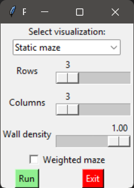
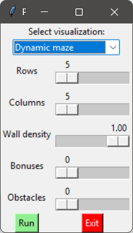

# Maze Navigation Planning vs Learning

## Project overview

This project compares classical pathfinding with reinforcement learning in maze environments. It includes implementations of A*, BFS, DFS, and Dijkstra alongside tabular Q-learning agents for both static and dynamic maze settings.

The repository is designed to evaluate planning versus learning across multiple scenarios and to capture how static and dynamic obstacles affect algorithm behavior. The full methodology and analysis are available in `report.pdf`.

## Features

- Maze generation for grid-based environments
- Classical search algorithms: A*, BFS, DFS, Dijkstra
- Static and dynamic Q-learning agents
- Dynamic obstacle simulation and reward-driven navigation
- Interactive visualizers using Pygame and Tkinter
- Experiment scripts for regenerating CSV and figure outputs

## Repository structure

- `src/algorithms` – pathfinding and learning algorithm implementations
- `src/visualization` – visualization scripts for static and dynamic mazes
- `src/experiments` – scripts to run experiments and generate results
- `experiment_results/results` – generated CSV summary files
- `experiment_results/figures` – generated experiment plots
- `img` – example screenshots and animation previews
- `report.pdf` – complete project report

## Installation

This project requires Python 3.11 or newer.

Create a virtual environment (optional):

```bash
python -m venv .venv
source .venv/bin/activate   # macOS / Linux
.venv\Scripts\activate    # Windows PowerShell
```

Install the required dependencies:

```bash
pip install numpy pygame pandas matplotlib
```

## Running the visualizer

Launch the interactive menu:

```bash
python src/visualization/visualize.py
```

From the menu, choose between:

- **Static maze visualization** – demonstrates classical search behavior and static Q-learning on a fixed maze
- **Dynamic maze visualization** – demonstrates dynamic obstacle motion, replanning, and a learned policy in a changing environment

## Running experiments

Experiment scripts are located in `src/experiments/` and can be executed individually to regenerate CSV results and plots. Use the script names to run the scenario you want without modifying the code structure.

## Example output

Static menu:



Static animation:


Dynamic menu:



Dynamic animation:


## Report

Full methodology, implementation details, experiment setup, and discussion are available in:

```text
report.pdf
```

## License

This project was developed for educational purposes as part of a university project.
